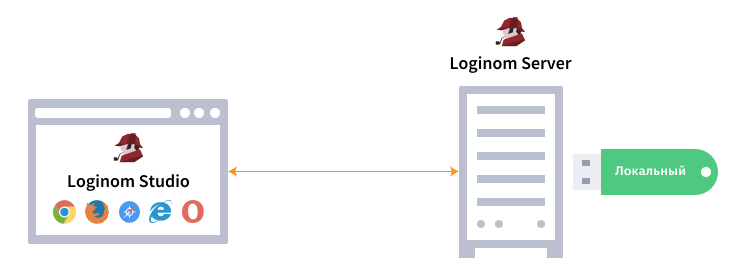

# Licensing Dongles

Loginom products are licensed by means of Guardant dongles:

* The **Local USB dongle** is a physical dongle that is recommended for one-off Loginom instances on servers with physical access to USB ports. [Guardant drivers](https://www.guardant.ru/support/download/drivers/) version 7.0 or higher are required.

* The **Network USB dongle** is a physical dongle that is recommended for a number of Loginom instances on the local network. Deployment of [network dongles server](https://www.guardant.ru/support/download/server/) version 7.0 or higher is required.

* The **Software SP dongle** is a software dongle that is recommended for one-off Loginom instances in virtual environments without physical access to USB ports.

> **Important**: An SP dongle is distinguished via cryptographic binding to the equipment, namely it is not possible to reactivate SP dongle after its activation or transfer it to another computer.

Several [physical dongle versions](./case.md) are available to users.

## Activation of Software SP Dongle

It is required to activate SP dongle before use of the platform components.

[Software SP Dongle Activation Manual](./sp-key-activate.md).

## Software SP Dongle Activation for Offline Systems

It is required to activate the software SP dongle before use of platform components, but without net access on the computer of the end user.

[Software SP Dongle Activation Manual without Net Access](./sp-key-activate-offline.md).

## Upgrade of Hardware USB Dongles

It is required to reprogram USB dongle in the case of acquisition of additional licenses for Loginom components or options. In that case, remote changing of the dongle memory content with exchange of special codes by e-mail is required.

[USB Dongles Upgrade Manual](./usb-upgrade.md).