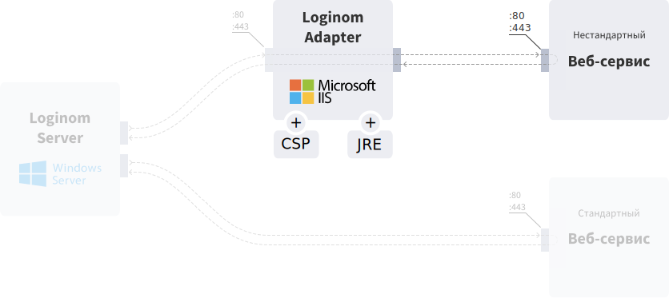
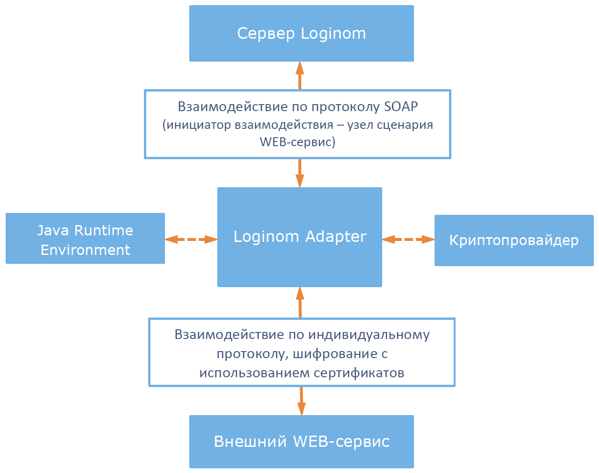

# Loginom Adapter

В аналитической платформе Loginom реализованы обращения к веб-сервисам c использованием протоколов SOAP и REST (см. [подключение веб-сервиса](https://help.loginom.ru/userguide/integration/connections/list/web-service.html)). Стандартные средства Loginom покрывают значительную часть всего разнообразия вариантов взаимодействия с веб-сервисами, но некоторые веб-сервисы могут использовать собственные протоколы и шифрование сообщений, при которых подключиться к ним стандартными средствами не возможно. Для решения этой задачи предназначен Loginom Adapter (далее, *адаптер*).

*Адаптер* представляет собой промежуточный веб-сервис между реализованным в Loginom сценарием и внешними веб-сервисами. Взаимодействие с *Адаптером* из сценария Loginom происходит по SOAP протоколу при помощи узла *Вызов веб-сервиса*.

*Адаптер*:
- преобразует полученный из сценария Loginom SOAP-запрос к формату запроса внешнего веб-сервиса;
- направляет преобразованный запрос во внешний веб-сервис;
- получает ответ внешнего веб-сервиса;
- преобразовывает полученный ответ и в формате SOAP возвращает его сценарию Loginom.
 

## Системные требования

### Аппаратное обеспечение

| Компонент | Минимальные | Рекомендуемые |
|:--- |:---|:--- |
| Процессор | Intel Core 2 Duo | Intel Xeon |
| Оперативная память | 1 Гб | 8 Гб |
| Жесткий диск | 10 Гб | 500 Гб |
| Управление | Клавиатура, мышь | &nbsp; |

### Обязательное программное обеспечение

| Компонент | Минимальные | Рекомендуемые |
|:--- |:---|:--- |
| Операционная система | Windows 7 | Windows Server 2008 и выше |
| Microsoft IIS | Версия не ниже 5.1 | Версия 7.5 и выше |
| .Net Framework | Версия 3.5 | &nbsp; |

> **Примечание**: Loginom Adapter использует в работе .Net Framework версии 3.5. Практика использования программы показывает, что возможна совместимость с .Net Framework версии 4.5.

Для работы адаптера требуется наличие ряда компонентов IIS и .Net Framework. Подробное описание см. в разделе [Установка](.\setup\README.md).

### Опциональное программное обеспечение

Для подключения к некоторым веб-сервисам могут использоваться сторонние криптопровайдеры (Cryptography Service Provider, CSP) и Java Runtime Environment (JRE). В таких случаях эти компоненты должны быть установлены на ПК вместе с *адаптером*.

#### Cryptography Service Provider (CSP)

При шифровании обмена данными с внешним веб-сервисом используются криптопровайдеры, например, Signal-COM CSP или CryptoPro CSP. Выбор криптопровайдера и его версии диктуется требованиями поддержки в нем необходимых для взаимодействия с конкретным веб-сервисом алгоритмов шифрования.

Непосредственно для подключения к тому или иному веб-сервису с применением шифрования потребуются соответствующие сертификаты.

#### Java Runtime Environment (JRE)

Java Runtime Environment (JRE) версии не ниже 6 — обязательное требование для подключения к сервисам [Национальный Хантер](https://bki-okb.ru/corp/services/national-hunter) и [Equifax FPS](https://www.equifax.ru).
