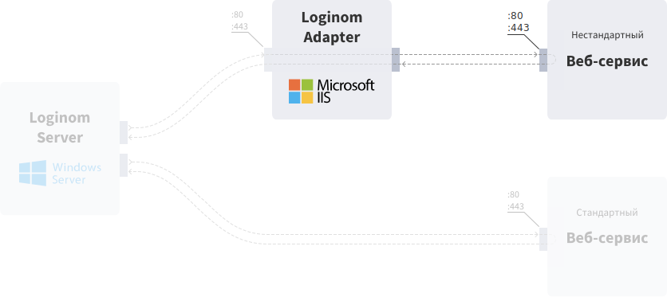

# Loginom Adapter

В аналитической платформе Loginom реализованы обращения к веб-сервисам c использованием протокола SOAP и REST (см. [подключение веб-сервиса](https://help.loginom.ru/userguide/integration/connections/list/web-service.html)), но некоторые веб-сервисы могут использовать собственные протоколы и шифрование сообщений, поэтому подключиться к ним напрямую средствами Loginom не возможно. Для решения этой задачи предназначен Loginom Adapter (далее, адаптер).

Адаптер представляет собой веб-сервис, который выполняет роль прокси-сервиса между реализованным в Loginom сценарием и внешними веб-сервисами.

Для подключения к некоторым веб-сервисам адаптер может использовать сторонний криптопровайдер и Java Runtime Environment. В таких случаях эти компоненты должны быть [установлены](./setup/additional-soft.md) на ПК вместе с адаптером.

## Системные требования

### Программное обеспечение

| Компонент | Минимальные | Рекомендуемые |
|:--------- |:-------------|:------------- |
| Операционная система | Windows 7 | Windows Server 2008 и выше |
| Microsoft Internet Information Services | Версия не ниже 5.1 | Версия 7.5 и выше |
| .Net Framework | Версия 3.5 | |

> **Примечание**: Loginom Adapter использует в работе .Net Framework версии 3.5. Практика использования программы показывает, что возможна совместимость с .Net Framework версии 4.5.

Для работы адаптера требуется наличие ряда компонентов IIS и .Net Framework. Подробное описание см. в разделе [Порядок установки](.\setup\README.md).

При шифровании обмена данными с внешним веб-сервисом обязательным условием является наличие установленного криптопровайдера, например, Signal-COM CSP или CryptoPro CSP версии не ниже 3.6. Выбор криптопровайдера и его версии диктуется требованиями поддержки в нем необходимых для взаимодействия с конкретным веб-сервисом алгоритмов шифрования.

Непосредственно для подключения к тому или иному веб-сервису с применением шифрования потребуются соответствующие сертификаты.

### Аппаратное обеспечение

| Компонент | Минимальные | Рекомендуемые |
|:--------- |:-------------|:------------- |
| Процессор | Intel Core 2 Duo | Intel Xeon |
| Оперативная память | 1 GB | 8 GB |
| Жесткий диск | 10 Гб | 500 Гб |
| HDD | 10 GB | 500 GB |
| Управление | Клавиатура, мышь | |

### Дополнительные требования

Java Runtime Environment версии не ниже 6 – обязательное требование для подключения к сервисам «Национальный Хантер» и «Equifax FPS».