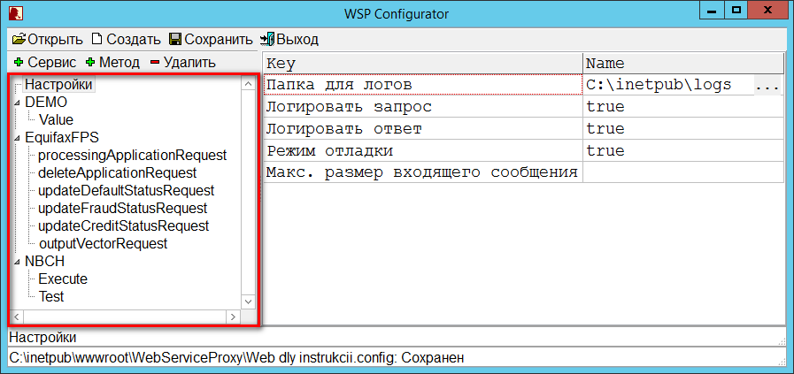

# Конфигурация Loginom Adapter

Работа Loginom Adapter настраивается с помощью xml файла [Web.config](https://ru.wikipedia.org/wiki/Web.config) через программу-конфигуратор **Loginom Adapter Configurator** (далее по тексту *Конфигуратор*). При установке по умолчанию находится в папке `C:\inetpub\wwwroot\LoginomAdapter\Configurator\`.

При сохранении настроек *Конфигуратор* перезаписывает файл `Web.config`. При этом запросы, полученные *Адаптером* до этого, будут завершены со старыми настойками. Следующие запросы к *Адаптеру* будут выполнены с учетом новых настроек.

## Добавление подключений к внешним сервисам

Помимо предустановленных в процессе инсталляции папок и файлов, в процессе настройки *Адаптера* в каталоге установки могут быть размещены дополнительные файлы (сертификаты, XSD-схемы и т.п.), необходимые для работы с внешними сервисами.

Вместе с *Адаптером* могут поставляться настройки подключений (коннекторы) к таким внешним сервисам, как, например, [EquifaxFPS](https://www.equifax.ru), *NationalHunter*, [Национальное бюро кредитных историй](https://www.nbki.ru/) (НБКИ), [Бюро кредитных историй — Объединенное Кредитное Бюро](https://bki-okb.ru) (БКИ — ОКБ), [QiwiScoring](https://corp.qiwi.com/business/banks/scoring.action) и другим. Как правило, дополнительные файлы этих настроек размещаются в подкаталогах **Data** и **Certificates** каталога установки. В файле `Web.config` при этом будут содержаться ссылки на эти файлы.

Пример структуры дополнительных файлов и папок, расположенных в каталоге установки `C:\inetpub\wwwroot\LoginomAdapter\`:

* **Certificates\\** — папка с сертификатами для подключения к веб-сервисам;
* **Data\\** — папка, хранящая настройки подключения к отдельным веб-сервисам. Эти настройки содержаться в подпапках:
  * **EquifaxFPS** — папка с дополнительными файлами настройки подключения к *Эквифакс*;
  * **NBCH** — папка с дополнительными файлами настройки подключения к *НБКИ*.

В файле `Web.config` допустимо использование как абсолютных путей на дополнительные файлы (с указанием буквы диска), так и относительных, которые задаются относительно расположения `Web.config`.

> Примечание: рекомендуется помещать дополнительные файлы в папку, в которой установлен *Адаптер*, а в файле конфигурации `Web.config` указывать к ним относительные пути. Это позволяет переносить *Адаптер* с одного компьютера на другой простым копированием папки с минимальным количеством перенастроек.

## Структура настроек

Интерфейс *Конфигуратора* состоит из двух панелей. На левой панели окна *Конфигуратора* располагается дерево навигации (рисунок 3.1), отображающее структуру настроек, на правой — сами настройки.

Дерево навигации представляет собой двухуровневую иерархическую структуру и включает в себя следующие элементы:

* Элементы первого (корневого) уровня:
  * Корневой элемент «Настройки». Содержит параметры общих настроек адаптера, представленных в разделе «Параметры общих настроек»;
  * Корневые элементы, обозначающие внешние сервисы, с которыми осуществляется взаимодействие (в конфигурации, представленной на рисунке 3.1, присутствуют три таких элемента: «DEMO», «EquifaxFPS» , «NBCH»). Содержат параметры настроек, представленных в разделе «Параметры настроек подключения к внешним сервисам»;
* Элементы второго уровня:
  * Методы, по которым осуществляется взаимодействие с соответствующими внешними сервисами – представлены подчиненными элементами с наименованиями методов (на рисунке 3.1 это элементы: «Value», «processingApplicationRequest», «deleteApplicationRequest» и другие). Содержат параметры настроек, представленных в разделе «Параметры настроек методов взаимодействия с внешними сервисами»;

Подобная структура предполагает, что внешних сервисов, с которыми работает адаптер, может быть несколько, и для каждого внешнего сервиса может быть определено несколько методов.
