# Работа с сертификатами

## Использование хранилищ сертификатов

При использовании протокола HTTPS в своей работе, внешние сервисы предоставляют клиентские сертификаты. На компьютере, на котором производится настройка подключения к веб-сервису, эти сертификаты рекомендуется помещать в хранилище сертификатов. Исключение составляют сертификаты, не содержащие закрытый ключ. Хранилища сертификатов должны быть доступны для пользователя, из-под которого работает пул приложений *Адаптера* в IIS. Хранилище сертификатов локального компьютера доступно для всех пользователей, имеющих соответствующие права. Хранилище пользователя доступно только для определенного пользователя.

> **Примечание**: В качестве ключевого носителя может использоваться реестр, но при этом у контейнера должен быть пустой пароль. В противном случае при первом обращении к контейнеру появится окно с запросом пароля, однако веб-сервис *Адаптера* предполагает работу в неинтерактивном режиме, т.е. без диалоговых окон.

> **Важно**: В случае, когда клиентский сертификат находится в хранилище, обязательна процедура его экспорта из хранилища в файл .CER в DER-кодировке X.509 и указания пути к этому файлу в параметре настроек *Адаптера* – *Путь к сертификату*. В противном случае *Адаптер* не сможет обратиться к клиентскому сертификату, расположенному в хранилище. Экспортируемый из хранилища файл выполняет роль ссылки на сертификат в хранилище, и не должен содержать в себе закрытый ключ. Для этого при экспорте должна быть активизирована соответствующая опция (см. далее рисунок *5.10 – Экспорт закрытого ключа*).

## Импорт сертификатов в хранилище

Если для хранения сертификата используется хранилище локального компьютера, то необходимо использовать оснастку Windows `Сертификаты – локальный компьютер`, если используется хранилище пользователя, то необходимо использовать оснастку `Сертификаты – текущий пользователь`.

Для запуска оснастки `Сертификаты – локальный компьютер` можно нажать правую кнопку мыши на кнопке `Пуск`, выбрать пункт меню `Выполнить` и набрать команду `mmc certlm.msc`. Оснастка `Сертификаты – текущий пользователь` вызывается командой `mmc certmgr.msc`.

Для вызова мастера импорта в окне оснастки надо выбрать в контекстном меню или в меню `Действие`-> `Все задачи`  -> `Импорт… ` (рисунок 5.2).

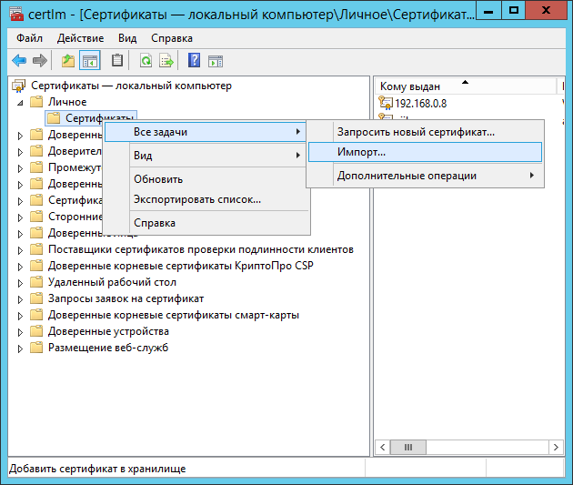

Далее необходимо пройти все шаги мастера импорта (рисунки 5.3 - 5.7).

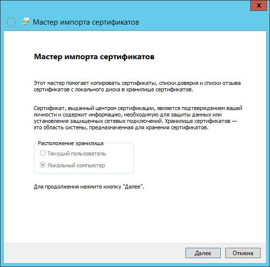

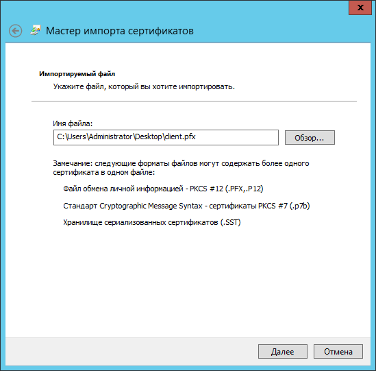

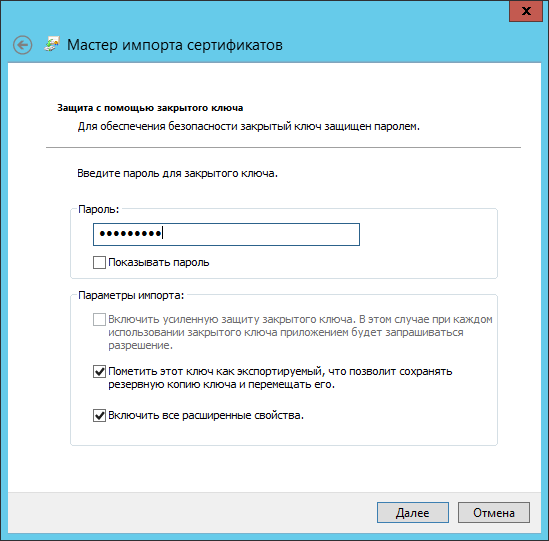

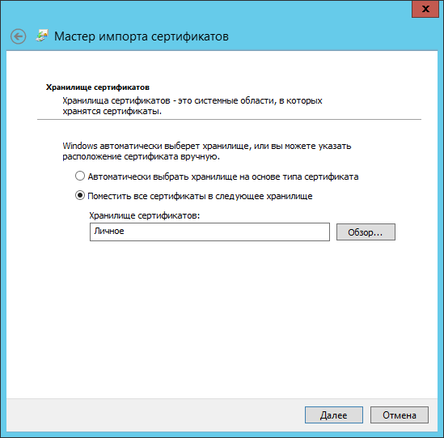

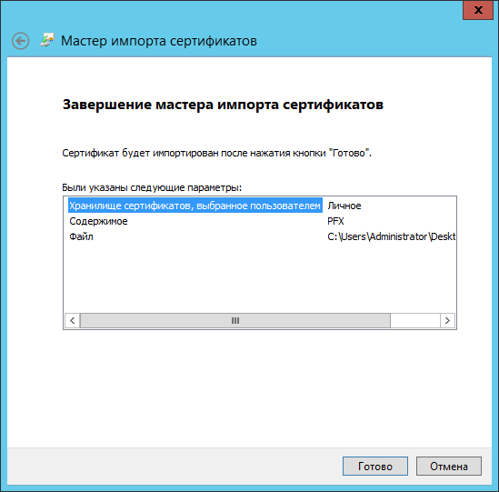

## Экспорт сертификатов из хранилища

Для вызова мастера экспорта в окне оснастки выбрать в контекстном меню необходимого сертификата `Все задачи` -> `Экспорт…` (рисунок 5.8).

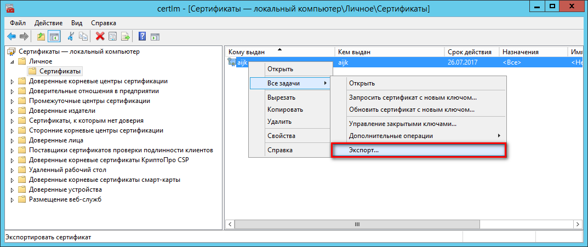

Далее необходимо пройти все шаги мастера экспорта (рисунки 5.9 - 5.12).

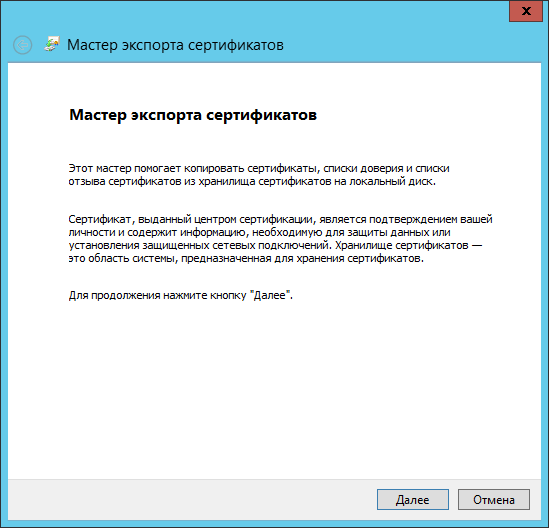

По кнопке `Далее` мастер экспорта предлагает выбрать: экспортировать или нет закрытый ключ (рисунок 5.10). Рекомендуется выбрать «Нет, не экспортировать закрытый ключ».

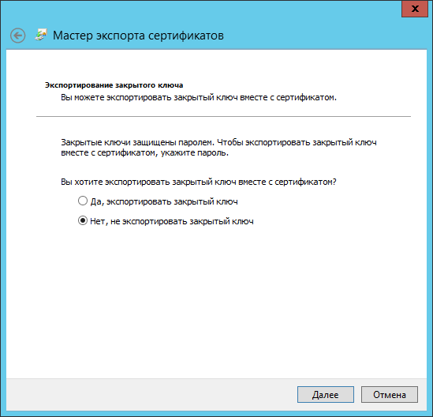

Далее выбирается формат `Файлы X.509 (.CER) в кодировке DER` экспортируемого файла (рисунок 5.11).

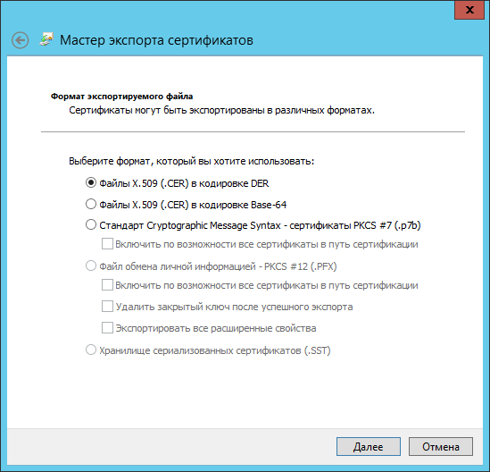

На следующем шаге необходимо указать имя экспортируемого файла (рисунок 5.12):

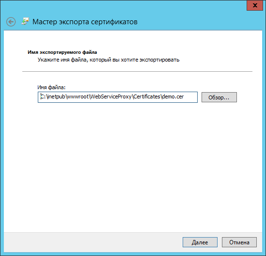

При нажатии на кнопку `Далее` мастер экспорта закрывается, и по указанному пути создается файл сертификата.

После экспорта сертификатов следует указать пути к ним в настройках *Адаптера*.

## Порядок обновления сертификатов

Периодически возникает необходимость в обновлении сертификатов. Процедура получения сертификата и порядок его установки для каждого из веб-сервисов описывается в документации, предоставляемой поставщиком услуг соответствующего веб-сервиса.

После обновления сертификата в хранилище необходимо экспортировать новый сертификат из хранилища сертификатов в файл `.CER` и обновить путь к нему в файле `Web.config`, либо перезаписать имеющийся файл с сертификатом под таким же именем.