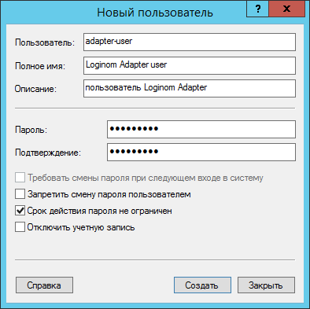

# Особая учетная запись

## Создание учетной записи

Для создания учетной записи необходимо открыть оснастку **Управление компьютером** (*Computer management*). Далее в группе **Локальные пользователи и группы** (*Local Users and Groups*) выбрать подгруппу **Пользователи** (*Users*) и в контекстном меню данной группы выбрать **Новый пользователь…** (*New User…*).

В открывшемся окне **Новый пользователь** (*New user*) необходимо:

* заполнить пустые поля;
* отключить «Требовать смены пароля при следующем входе в систему»;
* включить «Срок действия пароля не ограничен».

## Учетная запись для тестирования

Данный способ основан на включении учетной записи в группу администраторов и приемлем лишь для **`тестирования`** работы адаптера.

> Важно: в целях обеспечения защищенности IT-инфраструктуры, рекомендуется для созданной учетной записи назначать только необходимые для ее работы права (см. следующий раздел).

После создания пользователя необходимо поменять ему права. Для этого заходим в его свойства и выбираем вкладку **Членство в группах**. Здесь необходимо добавить группы *Administrators* и *IIS_IUSRS*, остальные можно удалить.

## Необходимые права

Учетной записи для полноценной работы необходимы следующие права:

1. Вход в качестве пакетного задания.
1. Доступ к хранилищу сертификатов веб-сервисов.
1. Установка прав на файлы и папки:
   * Чтение и запись в папку для лог-файлов (если в конфигурационном файле `Web.config` присутствует параметр **logFolder** и указана папка для логов).
   * Чтение папки, содержащей схемы описания сервисов. Пути к данным схемам заданы в атрибуте **schema** узлов **service** xml-файла `Web.config`.
   * Чтение папки, содержащей сертификаты. Пути к сертификатам заданы в атрибуте **certificate** узлов **service** xml-файла `Web.config`.
   * Чтение папки, содержащей файлы xslt-трансформации. Пути к файлам заданы в атрибутах **requestTransformation** и **responseTransformation** узлов **method** xml-файла `Web.config`.
   * Запуск сторонних приложений, выполняемых на этапах xslt-трансформации и *Выполнить программу*, если таковые приложения применяются.

### Вход в качестве пакетного задания

Для назначения данного права необходимо:

* открыть оснастку **Локальная политика безопасности** (*Local Security Policy*), например, через меню **Выполнить**, набрав команду `secpol.msc`;
* открыть группу **Локальные политики** (*Local Policies*) -> **Назначение прав пользователя** (*User Rights Assignment*);
* выбрать право **Вход в качестве пакетного задания**;
* в открывшемся окне свойств перейти на вкладку **Параметр локальной безопасности**, нажать кнопку **Добавить пользователя или группу…** и указать созданного пользователя.

### Доступ к хранилищу сертификатов веб-сервисов

Клиентские сертификаты сервисов, к которым осуществляется обращение из *Адаптера*, могут помещаться в хранилище сертификатов либо локального компьютера либо текущего пользователя (подробнее см. Приложение `Работа с сертификатами`).

В случае хранения сертификатов в хранилище текущего пользователя, доступ пользователя к нему осуществляется системой по умолчанию. Однако, для интерактивной работы (помещение и выгрузка сертификата) с таким хранилищем пользователю пула приложений необходимо войти в систему под своей учетной записью. Для этого ему необходимо в оснастке **Локальная политика безопасности** предоставить право на **Локальный вход в систему**.

В случае использования хранилища локального компьютера, пользователю пула приложений необходимо предоставить доступ к сертификату. Для этого необходимо:

* открыть оснастку **Сертификаты – локальный компьютер**;
* открыть группу **Личное** -> **Сертификаты**;
* у клиентского сертификата вызвать контекстное меню и выбрать команду **Управление закрытыми ключами…**;
* для пользователя необходимо разрешить **чтение** сертификата из хранилища локального компьютера.

### Установка прав на файлы и папки

Данные настройки задаются через интерфейс [Конфигуратора](../config/README.md).

#### Логирование

Адаптер имеет возможность логировать свою работу. При этом пользователю пула приложений, под которым работает адаптер, необходимы права на запись лог-файлов. Для этого в *Конфигураторе* в общих настройках следует задать значение параметру **Папка для логов**, например, `c:\inetpub\logs`.

#### XSD-схеме описания сервиса

Также пользователю необходимы права на чтение папки, содержащей схемы описания сервисов. Для этого в параметрах настроек подключения к внешним сервисам следует задать значение параметру **Схема, на которую будет ссылаться описание сервиса**, например, `data\is\xsd4.xsd`.

#### Сертификаты

Если необходимо использовать сертификаты, то следует задать значение параметру **Путь к сертификату**, например, `certificates\is\myservice.cer`, а также указать **пароль к сертификату**.

#### Чтение папки, содержащей файлы xslt-трансформации

В процессе выполнения преобразований запросов и ответов [см. раздел Настройка роли клиента внешних сервисов](./) на этапах *XSLT-трансформация* и *Выполнение программы* могут вызываться сторонние приложения (java, exe). Пользователь также должен иметь права **на запуск** этих приложений и права на **чтение/запись** входных/выходных файлов, которые могут присутствовать в качестве параметров этих приложений.

При использовании XSLT-трансформации используются файлы скриптов, путь к которым задается в параметрах **XSLT для трансформации входящего сообщения перед передачей** и **XSLT для трансформации ответного сообщения**. Эти файлы должны быть доступны для **чтения** пользователю пула приложений.

В общем случае, для назначения вышеперечисленных прав необходимо задать соответствующие разрешения для файлов или папок их размещения. Для этого из контекстного меню папки/файла необходимо вызвать окно **Свойства**, перейти на вкладку **Безопасность** и по кнопке **Изменить** добавить пользователя пула приложений и отредактировать его разрешения (разрешить *чтение* и/или *запись*).
