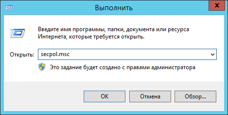
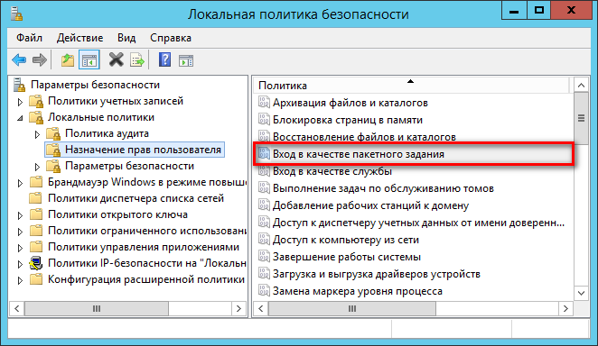
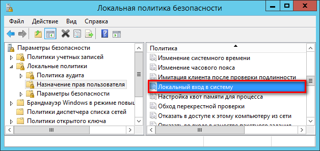
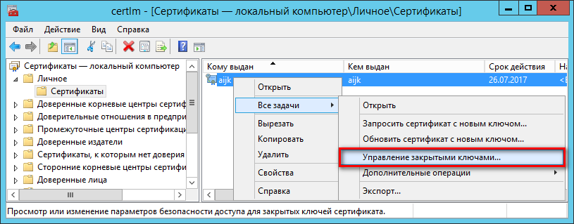
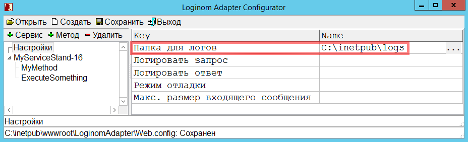
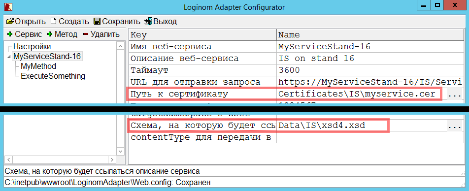

# Особая учетная запись

## Создание учетной записи

Для создания учетной записи необходимо открыть оснастку *Управление компьютером* (`Computer management`). Это можно сделать щелкнув правой кнопкой мыши на кнопке «Пуск» и выбрать «Управление компьютером».

Далее в группе *Локальные пользователи и группы* (`Local Users and Groups`) выбрать подгруппу *Пользователи* (`Users`) и в контекстном меню данной группы выбрать *Новый пользователь…* (`New User…`).

В открывшемся окне `Новый пользователь` (*New user*) необходимо:

* заполнить пустые поля;
* отключить «Требовать смены пароля при следующем входе в систему»;
* включить «Срок действия пароля не ограничен».

## Учетная запись для тестирования

Данный способ основан на включении учетной записи в группу администраторов и приемлем лишь для **`тестирования`** работы адаптера.

> Важно: в целях обеспечения защищенности IT-инфраструктуры, рекомендуется для созданной учетной записи назначать только необходимые для ее работы права (см. следующий раздел).

После создания пользователя необходимо поменять ему права. Для этого заходим в его свойства и выбираем вкладку `Членство в группах`. Здесь необходимо добавить группы **`Administrators`** и **`IIS_IUSRS`**, остальные можно удалить.

## Настройка необходимых прав учетной записи

Учетной записи для полноценной работы необходимы следующие права:

1. Вход в качестве пакетного задания.
1. Доступ к хранилищу сертификатов веб-сервисов.
1. Установка прав на файлы и папки:
   * Чтение и запись в папку для лог-файлов (если в конфигурационном файле Web.config присутствует параметр logFolder и указана папка для логов).
   * Чтение папки, содержащей схемы описания сервисов. Пути к данным схемам заданы в атрибуте «schema» узлов «service» xml-файла Web.config.
   * Чтение папки, содержащей сертификаты. Пути к сертификатам заданы в атрибуте «certificate» узлов «service» xml-файла Web.config.
   * Чтение папки, содержащей файлы xslt-трансформации. Пути к файлам заданы в атрибутах «requestTransformation» и «responseTransformation» узлов «method» xml-файла Web.config.
   * Запуск сторонних приложений, выполняемых на этапах xslt-трансформации и «Команда ОС», если таковые приложения применяются.

### Вход в качестве пакетного задания

Для назначения права «Вход в качестве пакетного задания» (`Log on as batch job`) необходимо вызвать оснастку «Локальная политика безопасности» (`Local Security Policy`), например, через меню «Выполнить», набрав команду `secpol.msc` (см. рис.):

В окне оснастки в группе «Локальные политики» (`Local Policies`) -> «Назначение прав пользователя» (`User Rights Assignment`) выбрать право «Вход в качестве пакетного задания» (см. рис.).

В открывшемся окне свойств перейти на вкладку «Параметр локальной безопасности», нажать кнопку "Добавить пользователя или группу…" и указать созданного пользователя (adapter-user).

### Доступ к хранилищу сертификатов веб-сервисов

Клиентские сертификаты сервисов, к которым осуществляется обращение из *Адаптера*, могут помещаться в хранилище сертификатов локального компьютера или текущего пользователя (подробнее см. Приложение В). В случае хранения сертификатов в хранилище текущего пользователя, доступ пользователя к нему осуществляется системой по умолчанию. Однако, для интерактивной работы (помещение и выгрузка сертификата) с таким хранилищем пользователю пула приложений необходимо войти в систему под своей учетной записью. Для этого ему необходимо предоставить право локального входа в систему в оснастке «Локальная политика безопасности» (см. рис.).

В случае использования хранилища локального компьютера, пользователю пула приложений необходимо предоставить доступ к сертификату. Для этого  в оснастке «Сертификаты – локальный компьютер» в контекстном меню клиентского сертификата командой «Управление закрытыми ключами…» (см. рисунок Б.21) необходимо вызвать окно редактирования разрешений.

Pic Б.21

Для пользователя необходимо разрешить **чтение** сертификата из хранилища
локального компьютера и сохранить изменения кнопкой «ОК».

### Установка прав на файлы и папки

Данные настройки задаются, в основном, через интерфейс [Конфигуратора](../config/README.md) либо в файле *web.config*.

#### Логирование

Адаптер имеет возможность логировать свою работу. При этом пользователю пула приложений, под которым работает адаптер, необходимы права на запись лог-файлов. Для этого в Конфигураторе в общих настройках следует задать значение параметру *Папка для логов*:

#### XSD-схеме описания сервиса

Так же пользователю необходимы права на чтение папки, содержащей схемы описания сервисов. Для этого в параметрах настроек подключения к внешним сервисам следует задать значение параметру *Схема, на которую будет ссылаться описание сервиса*.

#### Сертификаты

Если необходимо использовать сертификаты, то следует задать значение параметру *Путь к сертификату* и указать *пароль к сертификату*.

(см. Конфигурация -> Описание параметров)

В процессе выполнения преобразований запросов и ответов (см. раздел Настройка роли клиента внешних сервисов) на этапах «XSLT-трансформация» и «Команда ОС» могут вызываться сторонние приложения (java, exe). Пользователь так же должен иметь права **на запуск** этих приложений и права на **чтение/запись** входных/выходных файлов, которые могут присутствовать в качестве параметров этих приложений.

При использовании XSLT-трансформации используются файлы скриптов, путь к которым задается в параметрах «XSLT для трансформации входящего сообщения перед передачей» и «XSLT для трансформации ответного сообщения». Эти файлы должны быть доступны для **чтения** пользователю пула приложений.

В общем случае, для назначения вышеперечисленных прав необходимо задать соответствующие разрешения для файлов или папок их размещения. Для этого из контекстного меню папки/файла необходимо вызвать окно «Свойства», перейти на вкладку «Безопасность» и по кнопке «Изменить» добавить пользователя пула приложений и отредактировать его разрешения (рисунок Б.19).

Pic Б.19
