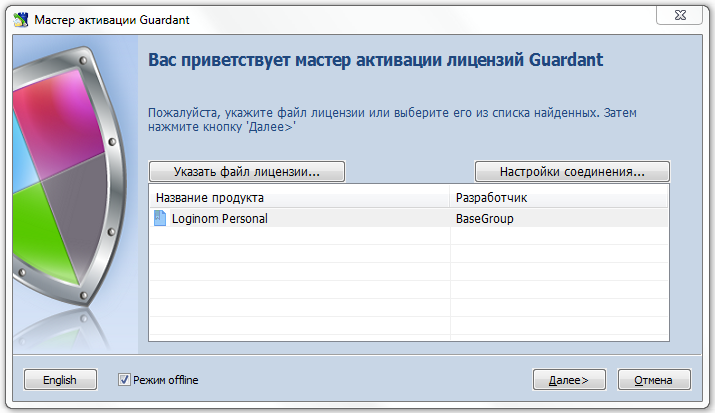
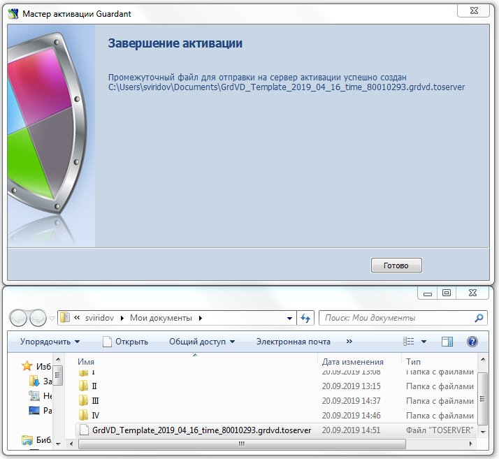
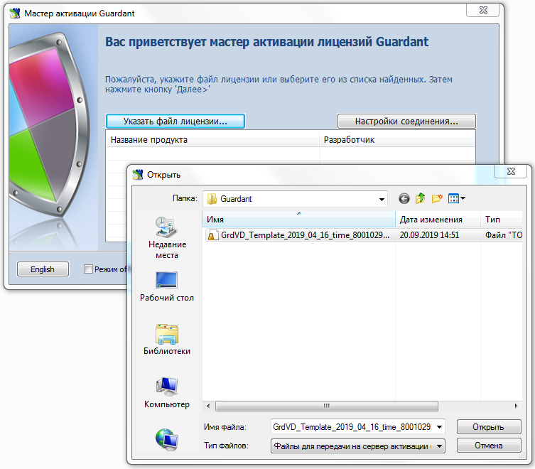
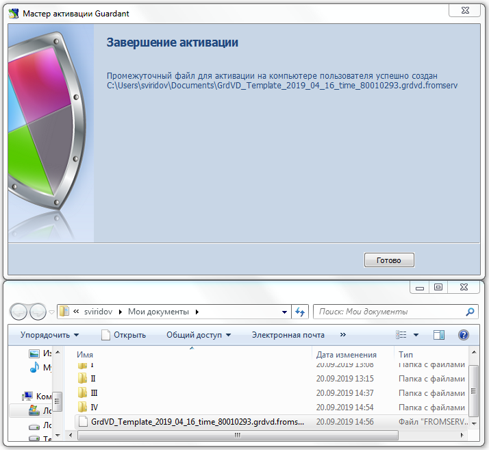
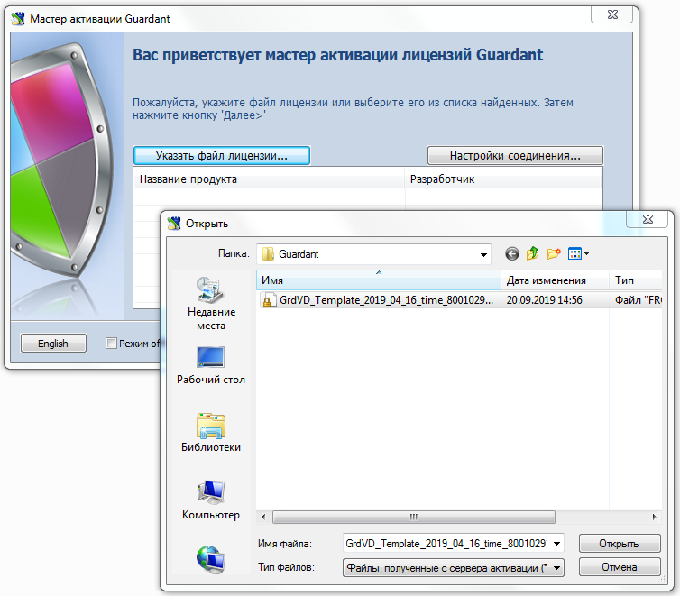

# Активация софтверного SP-ключа для систем без доступа к интернету

При недоступности в момент активации SP-ключа сети интернет (online-режим) для компьютера конечного пользователя существует [возможность активации в offline-режиме](https://dev.guardant.ru/pages/viewpage.action?pageId=1278815). Для этого необходимо выполнить ряд действий.

__1.__ Запустить Мастер активации Guardant (GuardantActivationWizard.exe), установить опцию "Режим offline" (внизу слева) и нажать кнопку "Далее":

 
__2.__ Ввести серийный номер программного ключа. После этого программа сгенерирует специальный файл для отправки на сервер активации:

__3.__ Этот файл необходимо перенести на компьютер, где есть доступ в интернет, запустить
Мастер активации (GuardantActivationWizard.exe), нажать кнопку "Указать файл лицензии…" и в выпадающем списке окна навигации указать в поле "Тип файлов:" параметр "Файлы для передачи на сервер активации (*toserver)":
 

__4.__ Программа соединится с сервером активации и сгенерирует еще один файл, который нужно перенести на компьютер конечного пользователя для завершения активации:

__5.__ На компьютере конечного пользователя запустить Мастер активации (GuardantActivationWizard.exe) (**Важно**: опцию "Режим offline" (внизу слева) не устанавливать), нажать кнопку "Указать файл лицензии" и, в открывшемся диалоге выбора файлов, указав тип файла "Файлы, полученные с сервера активации (*.fromserver)" выбрать нужный файл:

__6.__ Нажать кнопку "Далее":

__7.__ Процесс активации завершен:

