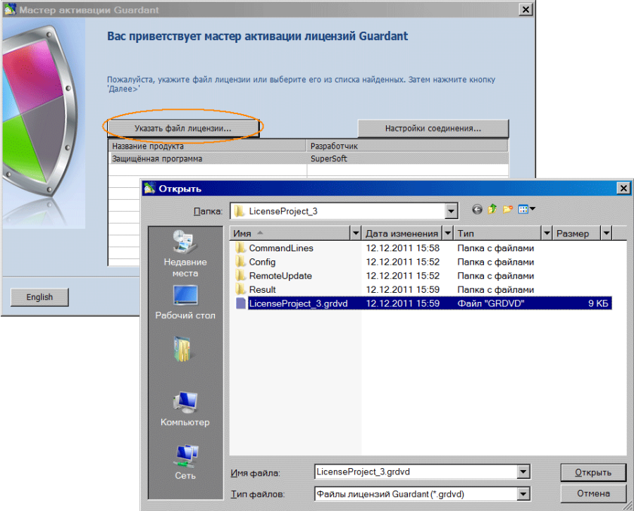
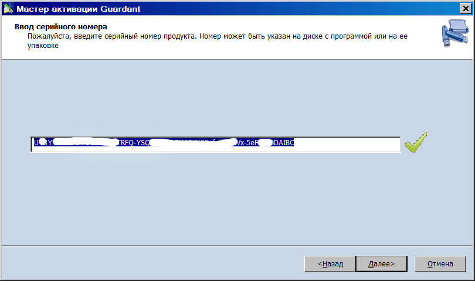
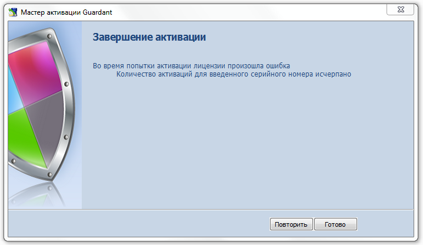

# Активация софтверного SP-ключа

Для успешной активации ключа требуется:

* Установленный драйвер Guardant версии не ниже 6.0.
* Утилита GuardantActivationWizard.exe, поставляющаяся в комплекте с SP-ключом.
* Запрограммированный шаблон ключа Guardant SP (файл вида *.grdvd).
* Серийный номер вида `9XZrwR-XXXXX-7NGDyS-XXXXX-qZGBcW-XXXXX-XoLBXF-xwqwXv-8oEO0o-XXXXX`.
* Компьютер, где будет выполняться активация, должен иметь доступ к серверу активации по адресу `https://sp.guardant.ru` в процессе инициализации ключа.

> **Важно**: Особенностью Guardant SP является криптографическая привязка к оборудованию, т.е. активированный ключ нельзя использовать на другом компьютере.

Чтобы активировать ключ Guardant SP, запустите мастер активации GuardantActivationWizard.exe и следуйте его указаниям:

**1.** При помощи кнопки "Указать файл лицензии" выберите путь к файлу вида *.grdvd. Проверьте настройки Интернет-соединения и нажмите на кнопку "Далее":

**2.** Укажите в поле ввода серийный номер для активации. Нажмите на кнопку "Далее":

Мастер производит необходимый обмен информацией с драйвером ключа и сервером активации. При этом, помимо прочего, происходит проверка введенного серийного номера, а также перешифрование файла софтверного ключа с использованием контрольных значений комплектующих компьютера.

**3.** Если активация прошла успешно, мастер выдает завершающее диалоговое окно:

