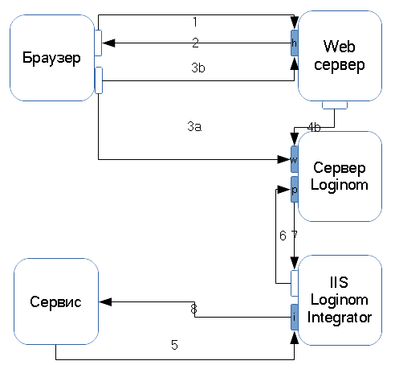

# Определения

## Сервер Loginom

### Хост сервера

Сетевой адрес (DNS, NetBios, IP) хоста, где установлен сервер Loginom.

### Порт websocket

Порт для подключения Loginom Studio по протоколу `ws` ([websocket](https://ru.wikipedia.org/wiki/WebSocket)).

### Порт websocket secure

Порт для подключения Loginom Studio по протоколу `wss` (websocket secure).

### Ключ SSL websocket

Ключ шифрования SSL для протокола `wss` в формате `pem`.

### Сертификат SSL websocket

Сертификат SSL для протокола `wss` в формате `pem`.

### Порт сервера

Порт для подключения Loginom Integrator и BatchLauncher.

## Loginom Studio

Web-интерфейс для работы со сценариями на сервере Loginom.

## Web-сервер

Web-сервер предоставляет клиенту web-интерфейс Loginom Studio. Также он может использоваться в качестве [websocket proxy](#websocket-proxy) для подключения к серверу Loginom.

Инсталлятор Loginom содержит web-сервер `Apache Httpd`, устанавливаемый по умолчанию.

При необходимости можно отказаться от его установки и использовать иной web-сервер, к примеру [IIS](./iis.md).

### Хост web-сервера

Сетевой адрес (DNS, NetBios, IP) хоста, где установлен web-сервер.

Web-сервер и сервер Loginom могут располагаться как на одном хосте, так и на разных.

### Порт web-сервера

### URI Loginom Studio

### Ключ SSL http

Ключ шифрования SSL для протокола `https` в формате `pem`.

### Сертификат SSL http

Сертификат SSL для протокола `wss` в формате `pem`.

### WebSocket proxy

## Схема работы

* При запросе (**1**) url `http(s)://web-server-host/app` в браузере загружается (**2**) Loginom Studio.
* Из конфигурации [server.json](./studio-config.md) формируется URL для подключения к серверу Loginom.
* Loginom Studio подключается к серверу Loginom по протоколу `websocket`.
  * Если [websocket proxy](#websocket-proxy) не используется, выполняется подключение к хосту сервера Loginom (**3a**) на порт `websocket (secure)`.
  * Иначе выполняется подключение к хосту web-сервера (**3b**) на порт `http(s)` с указанным URI. Web-сервер проксирует это подключение на хост сервера Loginom (**4b**) на порт `websocket (secure)`.
